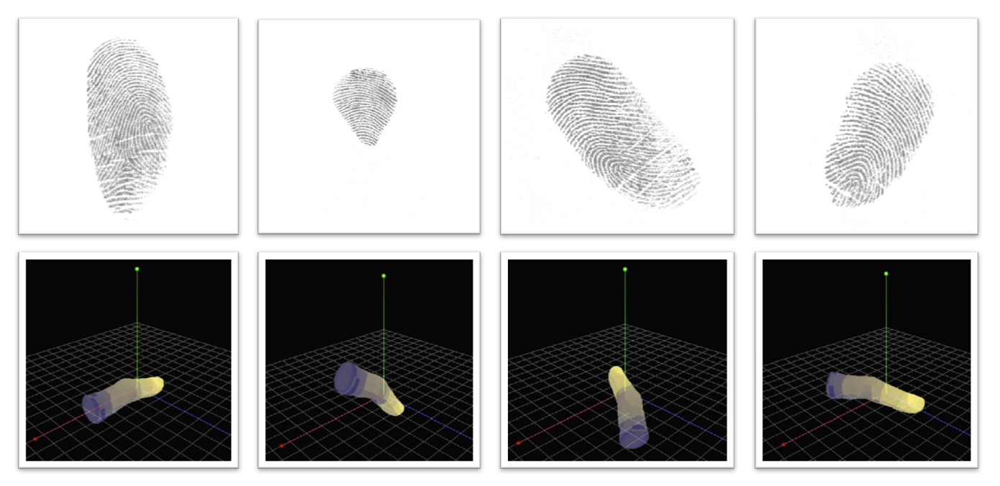
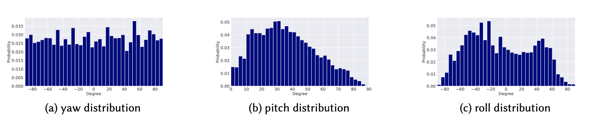
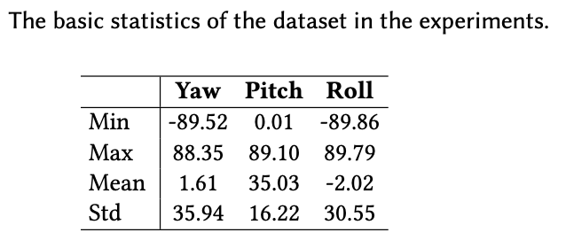

# 3DFingerPose
## **Notification**
The official website of this project is [link](http://ivg.au.tsinghua.edu.cn/data.php) (in the maintenance).

## Dataset description

**An Optical Fingerprint Database for Estimating 3D Finger Angle**

This database is collected for studying the problem of estimating 3D finger angles via fingerprint images. It consists of 54285 fingerprint images (55 ppi) and corresponding ground truth values of finger angle. Examples from the dataset are shown below.

<p align="center">
  
</p>

The dataset is gathered from 22 volunteers (10 female), whose ages range from 20 to 58 years old. The distribution of three angles and some other basic statistics of the dataset are given following.

<p align="center">
  
</p>

<p align="center">
  
</p>

## Download dataset

You are free to download the dataset and pre-trained model for non-commercial research and educational purposes: [3DFingerPose](https://cloud.tsinghua.edu.cn/d/92693b65055f4175bd71/)

##  Usage 
### Requirements
- torch>=1.7.0
- torchvision>=0.8.1
- timm==0.4.5
- yacs
- PYyaml

### Prepare dataset 
Download the [dataset](https://cloud.tsinghua.edu.cn/d/92693b65055f4175bd71/) and extract it in the root directory of this repo.

### Training
To train a model from scratch, run:
```
export CUDA_VISIBLE_DEVICES='0' # 1,2,3 
python train.py --cfg train.yaml
```
### Evaluation
Download the pre-trained model [here](https://cloud.tsinghua.edu.cn/d/92693b65055f4175bd71/), run: 
```
export CUDA_VISIBLE_DEVICES='0' # 1,2,3 
python test.py
```

## License
MIT License

## Reference
If you find our work useful in your research, please consider citing:
```
Ke He, Yongjie Duan, Jianjiang Feng, and Jie Zhou. 2022. Estimating 3D Finger Angle via Fingerprint Image. Proc. ACM Interact. Mob. Wearable Ubiquitous Technol. 6, 1, Article 14 (March 2022), 22 pages. https://doi.org/10.1145/3517243
```

## Contact

Contact Dr. [Jianjiang Feng](https://www.au.tsinghua.edu.cn/info/1154/2008.htm) for further information.
